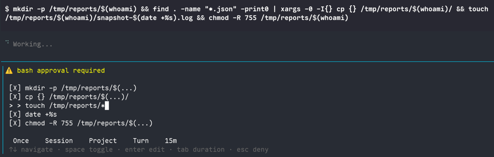

# pi-safetynet


A permissions and safety extension for [Pi](https://pi.dev) that understands what your AI agent is trying to do.

## The problem

In my experience, many harness permissions plugins treat shell commands as opaque strings — they see `"rm"` and flag it, or see `"sudo"` and flag it, but don't parse what's actually happening inside a pipeline, a redirect, or a `xargs` invocation. I've observed gaps like:

- `echo hello > /etc/passwd` sailing through because `echo` is "safe"
- `find . -name '*.ts' | xargs rm` getting approved because `find` is "safe"
- `sed -i s/foo/bar/ file.txt` treated the same as `sed -n 5p file.txt`
- `cat <<EOF > file.txt` heredoc writes going unnoticed
- `python3 -c "open('f','w').write('hi')"` being invisible because the guard only sees `python3`

These approaches tend to protect words, not actions.

## What pi-safetynet does differently

pi-safetynet takes two key approaches: **AST-aware command analysis** that parses what commands actually *do* rather than matching strings, and a **plan/build profile system** that lets you run the agent read-only until you explicitly allow changes.

Every bash command is parsed into a proper **AST** using [`@aliou/sh`](https://github.com/aliou/sh) and security decisions are made based on what the command *does*, not what strings it contains.



### AST-aware command analysis

Every `bash` tool call is parsed and decomposed into its constituent parts:

| What pi-safetynet extracts | Example | Why it matters |
|---|---|---|
| **Subcommands** in pipes/`&&`/`||` | `ls \| grep foo` → `[ls, grep foo]` | Each command is evaluated independently against the ruleset |
| **Output redirects** | `cmd > out.txt` → `edit: out.txt` | Redirects to real files are treated as edits — writing to a file is writing to a file |
| **Input redirects** | `sort < .env` → `read: .env` | Input redirects go through read-permission checks, catching secret file access |
| **xargs inner commands** | `xargs -0 rm` → `rm` | The *actual* command inside xargs is what gets evaluated, not `xargs` itself |
| **timeout inner command** | `timeout 10 rm` → `[timeout 10, rm]` | The wrapper (`timeout <dur>`) is preapproved; the inner command is evaluated normally |
| **sudo + underlying command** | `sudo rm file` → `sudo rm file` | sudo is always kept as a prefix; the inner command is still evaluated |
| **find -exec/-delete** | `find . -exec rm {} \;` → `find:exec` | `find` with destructive actions gets a dedicated classification |
| **Command substitutions** | `echo "$(whoami)"` → `[echo ..., whoami]` | Subcommands inside `$()` are recursively extracted |
| **Process substitutions** | `diff <(sort a) <(sort b)` → `[diff, sort a, sort b]` | Commands inside `<()` are recursively extracted |
| **Test expressions** | `[[ -f /etc/passwd ]]` → `read: /etc/passwd` | File-test operators are treated as file reads |
| **Heredoc bodies** | `cat <<EOF > file.txt` → redirect to `file.txt` | Heredoc bodies are stripped and the surrounding structure is still parsed |

#### A note on AST vs. string patterns

The AST tells us *what* is running — but when you approve a command, what gets saved as a rule is the **stringified form** of that subcommand, matched with a wildcard pattern. For example, approving `npm install express` creates a rule like `npm install *`.

This means the rules are still fundamentally string patterns, not structured command definitions. We haven't built something like "always allow `-p` for `mkdir`" because canonicalizing command representation would require knowing every flag of every possible shell command — which isn't practical. `mkdir -p src/lib` and `mkdir src/lib` are different strings, and without a flag database per command, we can't know they should be treated the same.

This is half a UI problem too: even if we could parse apart flags from positional args, how do you surface that to the user in a way that's useful and not overwhelming? For now, the wildcard pattern approach (`mkdir *` auto-approves all mkdir invocations) is a reasonable tradeoff between precision and usability.

### Plan / Build profiles

pi-safetynet provides a two-tier security model so you can keep the agent read-only until you're ready:

**Plan mode** (default) — `edit` and `write` tools are disabled. Read-only bash commands are auto-approved. Edit-equivalent bash commands (redirects, `sed -i`, interpreter one-liners, etc.) are **denied**, not just asked about. External file access requires approval.

**Build mode** — Full tool access. Allowlisted commands run silently. Unknown commands prompt for approval. Catastrophic commands are always blocked. Escalation from plan to build requires your approval; de-escalation is automatic.

**Plan-on-error** — When enabled (default), pi-safetynet injects a hint into bash error results suggesting the agent switch to plan mode, helpful when the agent gets stuck after a mistake.

### Catastrophic command blocking

System-destroying commands are **always denied**, regardless of profile or ruleset:

- `rm -rf /` / `rm -rf /usr` / `rm -rf /etc` / `rm -rf ~` / `rm -rf /*` / `rm --no-preserve-root`
- `chmod` / `chown` on protected directories
- `sudo` variants of all the above (with proper flag skipping — `sudo -u root rm /etc` is still caught)
- `xargs` variants (`xargs rm -rf /` is still catastrophic)
- `mkfs.*`, `dd of=/dev/`, `shutdown`, `reboot`, `halt`, `poweroff`

### Edit-equivalent bash detection

In **plan mode**, pi-safetynet doesn't just disable the `edit` and `write` tools — it also detects bash commands that are functionally equivalent to editing a file:

| Technique | Caught as "edit-like" |
|---|---|
| Output redirects (`>`, `>>`, `&>`, `>\|`, `<>`) | ✅ Redirect target goes through edit permission |
| Heredoc writes (`cat <<EOF > file`) | ✅ Heredoc body stripped, redirect still detected |
| `sed -i` / `perl -pi` / `perl -pe` | ✅ In-place edit flags detected |
| `tee` / `truncate` / `install` / `dd` | ✅ Write-purpose commands flagged |
| `python3 -c` / `node -e` / `ruby -e` / `perl -e` / `php -r` | ✅ Interpreter one-liners can embed arbitrary I/O |
| `sh -c` / `bash -c` | ✅ Subshell execution with code strings |
| Redirections to `/dev/null` and friends | ❌ Safe device files are excluded |

### Hazardous file protection

pi-safetynet automatically denies access to sensitive files, regardless of tool:

- `.env`, `.env.production`, `.env.local` (but not `.env.example`, `.env.sample`)
- `.envrc`, `.npmrc`, `.pypirc`, `.netrc`, `.dockercfg`
- SSH keys (`id_rsa`, `id_ed25519`, `id_ecdsa`, `*.pem`)
- `credentials.json/yaml`, `secrets.json/yaml`
- Anything under `.ssh/`, `.gnupg/`, `.aws/credentials`, `.docker/config.json`

These are blocked at the file-permission level — whether accessed via `read`, `edit`, `bash`, or redirect.

### Redirect-aware permission checks

When a bash command includes file redirects, pi-safetynet enforces the corresponding file-level permission:

```
echo secret > .env
         └── parsed as: edit .env → DENIED (hazardous file)

sort < /etc/passwd
     └── parsed as: read /etc/passwd → ASK (external path)

ls > out.txt
   └── parsed as: edit out.txt → ASK (edit catch-all)
```

I haven't seen another Pi permission plugin that parses redirects this way. pi-safetynet parses the AST and routes redirects through the correct permission tier.

### Project-boundary awareness

pi-safetynet detects your project root (the nearest `.pi/` directory) and treats paths outside it differently. Reads and writes to files inside the project follow the normal ruleset, but any access to files outside the project root — even reads that would otherwise be auto-approved by the `read: **` catch-all — requires explicit approval. This means `cat /etc/passwd` or `read` on `~/.ssh/config` will always prompt, even in build mode.

If you add a specific allow rule for an external path (e.g. `read: /etc/hosts`), that takes precedence and future accesses won't prompt.

You can disable the outside-cwd enforcement entirely with the `trustExternalPaths` setting. This is an **enforcement-only** flag: when enabled, all file paths are trusted the same as in-cwd paths (the `read: **` catch-all applies to external paths and `cd` to external directories is auto-approved), but path display logic is unchanged. Opt in via either the global config file or the CLI flag:

```json
{ "trustExternalPaths": true }
```

**Example:** `pi --trust-external-paths`

Hazardous-file protection (`.env`, `.ssh`, credentials, etc.) and catastrophic-command blocking are orthogonal and remain in effect.


## Approval durations

When pi-safetynet prompts for approval, you choose how long the permission lasts:

| Duration | Scope | Persistence |
|---|---|---|
| **Once** | This invocation only | Never saved — no rules created |
| **Turn** | Until the agent finishes its current turn | In-memory, cleared on `agent_end` |
| **Session** | Rest of this session | In-memory, survives across turns |
| **Project** | All future sessions in this project | Saved to `.pi/extensions/safetynet/approvals.json` |
| **Global** | All future sessions across all projects | Saved to `~/.config/pi-safetynet/config.json` |

## Permission prompts

The approval UI shows exactly what needs approval — individual subcommands in a pipeline, file redirects, or both. Each item can be toggled on/off, and items can be inline-edited before approval (e.g., narrow a `*` pattern to a specific path).

## Keyboard shortcuts

| Shortcut | Action |
|---|---|
| `Ctrl+\` | Toggle between plan and build mode |

## Configuration flags

| Flag | Default | Description |
|---|---|---|
| `--build` | `false` | Start in build mode (full access) |
| `--allow <rules>` | | Comma-separated allow rules (format: `permission: pattern`) |
| `--plan-on-error` | `true` | Enable plan-on-error mode |
| `--trust-external-paths` | `false` | Trust file paths outside the project root (skip external-path approval) |
**Example:** `pi --build --allow "edit: src/**, bash: npm *"`

## Commands

| Command | Description |
|---|---|
| `safetynet:plan` | Switch to plan mode |
| `safetynet:build` | Switch to build mode |
| `safetynet:rules` | Show current permission rules |
| `safetynet:plan-on-error` | Toggle plan-on-error mode |

## How it compares

This table reflects the gaps that motivated building pi-safetynet. I haven't rigorously audited every alternative — your experience may differ.

| Feature | pi-safetynet | Typical string-matching approaches |
|---|---|---|
| Bash command parsing | Full AST | `command.includes("rm")` |
| Pipeline subcommand extraction | ✅ Each cmd evaluated independently | Often a single opaque string |
| Redirect target tracking | ✅ `> file` → edit permission on file | Often not parsed separately |
| xargs inner command | ✅ Extracts and evaluates the inner command | May see only `xargs` |
| Heredoc write detection | ✅ Strips body, parses redirect | Heredoc content often invisible |
| `sed -i` vs `sed -n` distinction | ✅ In-place flags detected | Both may match `sed` |
| Interpreter one-liner detection | ✅ `python -c`, `node -e`, etc. | May see only the interpreter name |
| Plan mode bash write prevention | ✅ All edit-equivalent techniques blocked | Typically only edit/write tools disabled |
| Catastrophic command detection | ✅ AST-level: peels sudo flags, timeout, xargs, quotes | Often substring matching |
| `[ -f /etc/passwd ]` as file read | ✅ Test operators tracked as reads | Often not tracked as file access |
| Hazardous file protection | ✅ `.env`, `.ssh`, credentials, etc. | ⚠️ Varies — sometimes config-driven |
| External path approval | ✅ Auto-detects paths outside project root | Project root awareness varies |
| Per-subcommand approval | ✅ Approve/deny individual pipeline stages | Often all-or-nothing for the whole command |
| Redirect-aware file permissions | ✅ `sort < .env` blocked as hazardous read | Redirect targets often not checked |

## Rule system

pi-safetynet uses a layered rule system (last match wins):

1. **Baseline** — Built-in rules shipped with pi-safetynet (read-only commands auto-approved, writes asked, etc.)
2. **Global** — User-defined rules from `~/.config/pi-safetynet/config.json` (see below)
3. **Persisted** — User-approved rules saved to `.pi/extensions/safetynet/approvals.json`
4. **Flag** — Rules from the `--allow` CLI flag (session-scoped, not persisted)
5. **Session** — Rules added interactively during this session
5. **Temporary** — Turn-limited rules

### Global config

You can define rules that apply across all projects via the global config file at `~/.config/pi-safetynet/config.json`. This is useful for commands you always want to allow (or deny), regardless of which project you're working in.

```json
{
  "rules": [
    { "permission": "bash", "pattern": "npm test", "action": "allow", "modes": ["build", "plan"] },
    { "permission": "bash", "pattern": "cargo test", "action": "allow", "modes": ["build", "plan"] },
    { "permission": "bash", "pattern": "npm publish *", "action": "deny", "modes": ["build", "plan"] }
  ],
  "subagents": ["subagent_explore", "subagent_build"]
}
```

#### `subagents`

Controls which subagent tools are available to the agent. The value is an array of tool names:

- `"subagent_explore"` — read-only subagent for codebase inspection
- `"subagent_build"` — full build-access subagent

If the key is omitted or `null`, all subagent tools are enabled (the default). An empty array `[]` disables all subagent tools.

Examples:

```json
{ "subagents": ["subagent_explore"] }
{ "subagents": [] }
```

Each rule has:

- **`permission`** — `bash`, `edit`, `read`, or `*` (matches any)
- **`pattern`** — For `bash`/`*`: a command pattern where `*` is a wildcard (e.g. `npm *`). For `edit`/`read`: a [picomatch](https://github.com/micromatch/picomatch) glob pattern (e.g. `src/**/*.ts`).
- **`action`** — `allow`, `deny`, or `ask`
- **`modes`** — Which profiles the rule applies to: `["build"]`, `["plan"]`, or `["build", "plan"]`
- **`reason`** *(optional)* — A human-readable explanation included in the denial message when a `deny` rule blocks an action

#### Denylist-style rules

Because the rule system uses last-match-wins ordering, you can create denylist patterns: place a broad `allow` rule first, then `deny` (or `ask`) rules for specific exceptions. This works in the global config, project rules, and session rules alike.

For example, to allow all `npm` subcommands but deny `npm publish`:

```json
{
  "rules": [
    { "permission": "bash", "pattern": "npm *", "action": "allow", "modes": ["build", "plan"] },
    { "permission": "bash", "pattern": "npm publish *", "action": "deny", "modes": ["build", "plan"], "reason": "Publishing to npm should be done intentionally" }
}
```

Or to allow all `git` subcommands but require approval for force pushes:

```json
{
  "rules": [
    { "permission": "bash", "pattern": "git *", "action": "allow", "modes": ["build"] },
    { "permission": "bash", "pattern": "git push --force *", "action": "ask", "modes": ["build"] },
    { "permission": "bash", "pattern": "git push -f *", "action": "ask", "modes": ["build"] }
  ]
}
```

For file edits, you could auto-approve editing source files but always ask about migrations:

```json
{
  "rules": [
    { "permission": "edit", "pattern": "src/**", "action": "allow", "modes": ["build"] },
    { "permission": "edit", "pattern": "**/migrations/**", "action": "ask", "modes": ["build"] }
  ]
}
```

You can also add global rules through the approval prompt by selecting **Global** as the duration.

Rules support both profile modes, so a rule can be scoped to build mode only and remain invisible to plan mode.

## License

This project is licensed under the Mutualist License v1.2.  
See the [LICENSE.md](LICENSE.md) file for the full text.

### Mutualist License summary

**Permissions**

- ✅ Commercial use
- ✅ Private / internal use
- ✅ Modification
- ✅ Distribution (source and binaries)
- ✅ Network / SaaS use
- ✅ Patent use (from contributors, as described in the license)

**Conditions**

- ❗ Keep copyright and license notices
- ❗ Give appropriate credit (see "Credit" in the license)
- ❗ Share source for modified versions you distribute
- ❗ Share source for modified versions you let others use over a network
- ❗ License your changes under the Mutualist License too (same license)
- ❗ Don't add technical measures (like DRM) that stop users from exercising their rights
- ❗ Patent peace: you lose patent rights under this license if you start a patent attack over this software

**Limitations**

- ❌ No liability
- ❌ No warranty
- ❌ No trademark rights
- ❌ No implied endorsement
