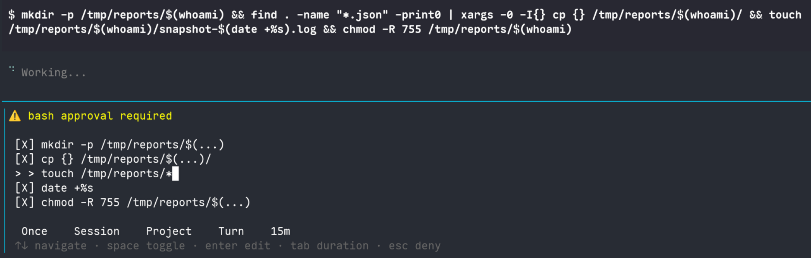

# pi-safetynet


A permissions and safety extension for [Pi](https://pi.dev) that understands what your AI agent is trying to do.

## The problem

In my experience, many harness permissions plugins treat shell commands as opaque strings — they see `"rm"` and flag it, or see `"sudo"` and flag it, but don't parse what's actually happening inside a pipeline, a redirect, or a `xargs` invocation. I've observed gaps like:

- `echo hello > /etc/passwd` sailing through because `echo` is "safe"
- `find . -name '*.ts' | xargs rm` getting approved because `find` is "safe"
- `sed -i s/foo/bar/ file.txt` treated the same as `sed -n 5p file.txt`
- `cat <<EOF > file.txt` heredoc writes going unnoticed
- `python3 -c "open('f','w').write('hi')"` being invisible because the guard only sees `python3`

These approaches tend to protect words, not actions.

## What pi-safetynet does differently

pi-safetynet takes two key approaches: **AST-aware command analysis** that parses what commands actually *do* rather than matching strings, and a **plan/build profile system** that lets you run the agent read-only until you explicitly allow changes.

Every bash command is parsed into a proper **AST** using [`@aliou/sh`](https://github.com/aliou/sh) and security decisions are made based on what the command *does*, not what strings it contains.



### AST-aware command analysis

Every `bash` tool call is parsed and decomposed into its constituent parts:

| What pi-safetynet extracts | Example | Why it matters |
|---|---|---|
| **Subcommands** in pipes/`&&`/`||` | `ls \| grep foo` → `[ls, grep foo]` | Each command is evaluated independently against the ruleset |
| **Output redirects** | `cmd > out.txt` → `edit: out.txt` | Redirects to real files are treated as edits — writing to a file is writing to a file |
| **Input redirects** | `sort < .env` → `read: .env` | Input redirects go through read-permission checks, catching secret file access |
| **xargs inner commands** | `xargs -0 rm` → `rm` | The *actual* command inside xargs is what gets evaluated, not `xargs` itself |
| **timeout inner command** | `timeout 10 rm` → `[timeout 10, rm]` | The wrapper (`timeout <dur>`) is preapproved; the inner command is evaluated normally |
| **sudo + underlying command** | `sudo rm file` → `sudo rm file` | sudo is always kept as a prefix; the inner command is still evaluated |
| **find -exec/-delete** | `find . -exec rm {} \;` → `find:exec` | `find` with destructive actions gets a dedicated classification |
| **Command substitutions** | `echo "$(whoami)"` → `[echo ..., whoami]` | Subcommands inside `$()` are recursively extracted |
| **Process substitutions** | `diff <(sort a) <(sort b)` → `[diff, sort a, sort b]` | Commands inside `<()` are recursively extracted |
| **Test expressions** | `[[ -f /etc/passwd ]]` → `read: /etc/passwd` | File-test operators are treated as file reads |
| **Heredoc bodies** | `cat <<EOF > file.txt` → redirect to `file.txt` | Heredoc bodies are stripped and the surrounding structure is still parsed |

#### A note on AST vs. string patterns

The AST tells us *what* is running — but when you approve a command, what gets saved as a rule is the **stringified form** of that subcommand, matched with a wildcard pattern. For example, approving `npm install express` creates a rule like `npm install *`.

This means the rules are still fundamentally string patterns, not structured command definitions. We haven't built something like "always allow `-p` for `mkdir`" because canonicalizing command representation would require knowing every flag of every possible shell command — which isn't practical. `mkdir -p src/lib` and `mkdir src/lib` are different strings, and without a flag database per command, we can't know they should be treated the same.

This is half a UI problem too: even if we could parse apart flags from positional args, how do you surface that to the user in a way that's useful and not overwhelming? For now, the wildcard pattern approach (`mkdir *` auto-approves all mkdir invocations) is a reasonable tradeoff between precision and usability.

### Plan / Build profiles

pi-safetynet provides a two-tier security model so you can keep the agent read-only until you're ready:

**Plan mode** (default) — `edit` and `write` tools are disabled. Read-only bash commands are auto-approved. Edit-equivalent bash commands (redirects, `sed -i`, interpreter one-liners, etc.) are **denied**, not just asked about. External file access requires approval.

**Build mode** — Full tool access. Allowlisted commands run silently. Unknown commands prompt for approval. Catastrophic commands are always blocked. Escalation from plan to build requires your approval; de-escalation is automatic.

**Plan-on-error** — When enabled (default), pi-safetynet injects a hint into bash error results suggesting the agent switch to plan mode, helpful when the agent gets stuck after a mistake.

**Auto-approve** — `/safetynet:auto` toggles automatic permission approval. When enabled, every action the ruleset flags as Ask is routed to a configurable permissions model (a read-only subagent with read/grep/find/ls) that judges the action against a risk policy instead of prompting the user. It runs alongside whatever profile (plan or build) you're in — status shows `+auto`.

The reviewer returns a JSON assessment `{risk_level, user_authorization, outcome, rationale}`:

- It judges against the **user's own messages only** — the transcript it sees contains just the human conversation, never the assistant's tool calls or outputs, so its own momentum can't look like consent. It can still verify local state itself with read-only tools.
- **Egress is high risk.** Pushing to a remote, connecting to a host, publishing, or deploying to a destination the user never named is treated as unauthorized egress and denied, not waved through as routine.
- **Authorization defaults to `unknown`.** Only the user's own messages establish `user_authorization`; a missing score defaults to `unknown` rather than guessing lenient.
- **Allow** — creates a turn-scoped temp rule so repeats in the same turn skip re-review. The model sees a hidden nudge.
- **Deny** — blocks with the rationale, keeps the turn alive so the model can try a safer alternative. After 3 consecutive denials the turn is aborted.
Every denial is surfaced in two places:
- **On the rejected tool call** — the blocked call's error result reads `Auto-denied <permission>: <target> — <rationale>` (a `Ruleset denied …` or `Denied …` prefix for deny-rule/headless denials). The reviewer's internal risk/authorization scores are not shown.
- **To the model** — a hidden transcript message carries the same line so the reason reaches the model even when the denial aborts the turn. When the denial aborts, the message is also rendered as a visible transcript entry next to the rejected call.
- **Infrastructure failure** (timeout, API error, unparseable) — falls back to the interactive permission prompt with a notice, while retrying the reviewer every 30s. If a retry succeeds the prompt is dismissed automatically.

Configure which model handles review and timeouts in global config:

```json
{ "autoApprove": { "model": "provider/model-id", "timeoutMs": 90000, "maxDenials": 3, "retryIntervalMs": 30000, "maxRetries": 2 } }
```


### Catastrophic command blocking

System-destroying commands are **always denied**, regardless of profile or ruleset:

- `rm -rf /` / `rm -rf /usr` / `rm -rf /etc` / `rm -rf ~` / `rm -rf /*` / `rm --no-preserve-root`
- `chmod` / `chown` on protected directories
- `sudo` variants of all the above (with proper flag skipping — `sudo -u root rm /etc` is still caught)
- `xargs` variants (`xargs rm -rf /` is still catastrophic)
- `mkfs.*`, `dd of=/dev/`, `shutdown`, `reboot`, `halt`, `poweroff`

### Edit-equivalent bash detection

In **plan mode**, pi-safetynet doesn't just disable the `edit` and `write` tools — it also detects bash commands that are functionally equivalent to editing a file:

| Technique | Caught as "edit-like" |
|---|---|
| Output redirects (`>`, `>>`, `&>`, `>\|`, `<>`) | ✅ Redirect target goes through edit permission |
| Heredoc writes (`cat <<EOF > file`) | ✅ Heredoc body stripped, redirect still detected |
| `sed -i` / `perl -pi` / `perl -pe` | ✅ In-place edit flags detected |
| `tee` / `truncate` / `install` / `dd` | ✅ Write-purpose commands flagged |
| `python3 -c` / `node -e` / `ruby -e` / `perl -e` / `php -r` | ✅ Interpreter one-liners can embed arbitrary I/O |
| `sh -c` / `bash -c` | ✅ Subshell execution with code strings |
| Redirections to `/dev/null` and friends | ❌ Safe device files are excluded |

### Hazardous file protection

pi-safetynet automatically denies access to sensitive files, regardless of tool:

- `.env`, `.env.production`, `.env.local` (but not `.env.example`, `.env.sample`)
- `.envrc`, `.npmrc`, `.pypirc`, `.netrc`, `.dockercfg`
- SSH keys (`id_rsa`, `id_ed25519`, `id_ecdsa`, `*.pem`)
- `credentials.json/yaml`, `secrets.json/yaml`
- Anything under `.ssh/`, `.gnupg/`, `.aws/credentials`, `.docker/config.json`

These are blocked at the file-permission level — whether accessed via `read`, `edit`, `bash`, or redirect.

Hazardous-file denials do **not** abort the conversation. Instead the model receives the instructional message as a non-aborting nudge, so it can course-correct (ask the user, use an env var) or move on. To stop loophole-hunting, each scope (main session, and each subagent independently) allows up to **3** hazardous denials per turn — the 3rd aborts the turn. The counter resets on `agent_end`.

### Redirect-aware permission checks

When a bash command includes file redirects, pi-safetynet enforces the corresponding file-level permission:

```
echo secret > .env
         └── parsed as: edit .env → DENIED (sensitive file: contains secrets, access blocked)

sort < /etc/passwd
     └── parsed as: read /etc/passwd → ASK (external path)

ls > out.txt
   └── parsed as: edit out.txt → ASK (edit catch-all)
```

I haven't seen another Pi permission plugin that parses redirects this way. pi-safetynet parses the AST and routes redirects through the correct permission tier.

### Project-boundary awareness

pi-safetynet detects your project root (the nearest `.pi/` directory) and treats paths outside it differently. Reads and writes to files inside the project follow the normal ruleset, but any access to files outside the project root — even reads that would otherwise be auto-approved by the `read: **` catch-all — requires explicit approval. This means `cat /etc/passwd` or `read` on `~/.ssh/config` will always prompt, even in build mode.

If you add a specific allow rule for an external path (e.g. `read: /etc/hosts`), that takes precedence and future accesses won't prompt.

You can disable the outside-cwd enforcement entirely with the `trustExternalPaths` setting. This is an **enforcement-only** flag: when enabled, all file paths are trusted the same as in-cwd paths (the `read: **` catch-all applies to external paths and `cd` to external directories is auto-approved), but path display logic is unchanged. Opt in via either the global config file or the CLI flag:

```json
{ "trustExternalPaths": true }
```

**Example:** `pi --trust-external-paths`

Hazardous-file protection (`.env`, `.ssh`, credentials, etc.) and catastrophic-command blocking are orthogonal and remain in effect.


## Approval durations

When pi-safetynet prompts for approval, you choose how long the permission lasts:

| Duration | Scope | Persistence |
|---|---|---|
| **Once** | This invocation only | Never saved — no rules created |
| **Turn** | Until the agent finishes its current turn | In-memory, cleared on `agent_end` |
| **Session** | Rest of this session | In-memory, survives across turns |
| **Project** | All future sessions in this project | Saved to `.pi/extensions/safetynet/approvals.json` |
| **Global** | All future sessions across all projects | Saved to `~/.config/pi-safetynet/config.json` |

## Permission prompts

The approval UI shows exactly what needs approval — individual subcommands in a pipeline, file redirects, or both. Each item can be toggled on/off, and items can be inline-edited before approval (e.g., narrow a `*` pattern to a specific path).

From the prompt you can either approve (with a chosen duration) or reject the call. There are two deny actions, each with its own shortcut:

- **Deny and abort** — ends the turn. The model stops and you get the prompt back. Bound to `denyAbort` (default: `Esc`).
- **Deny and continue** — non-aborting. The model keeps its turn and sees the deny reason as the tool's error result, so it can react (e.g. try a different command) without losing in-progress work. Bound to `denyContinue` (no default — see [Prompt keybindings](#prompt-keybindings) to enable). By default, use the `[Deny…]` row instead: arrow down to it, type a reason, and Enter to submit (empty Enter = deny with no reason).

When the deny editor is focused, `Esc` backs out to the duration selector without aborting (no matter how `denyAbort` is bound).

### Number shortcuts

From the duration selector, press `1`–`5` to pick a duration and approve immediately with the currently-checked items:

1. Once  ·  2. Session  ·  3. Project  ·  4. Turn  ·  5. Global

## Keyboard shortcuts

### Global shortcuts

These are pi global shortcuts (work outside the prompt too):

| Shortcut | Action | Configurable |
|---|---|---|
| `Ctrl+\` | Toggle between plan and build mode | yes — `toggleModeKey` |
| `Ctrl+Shift+\` | Show the current plan | no |

### Prompt keybindings

| Action | Default | Config field |
|---|---|---|
| Deny and abort | `escape` | `keybindings.denyAbort` |
| Deny and continue | *(unbound)* | `keybindings.denyContinue` |

Key identifiers use pi-tui's key-id form (the same form pi uses for its own keybindings): single chars like `"n"`, special keys like `"escape"`/`"enter"`, and modified keys like `"ctrl+c"` or `"shift+n"`. Note that pi-tui lowercases single-char ids, so a bare `"N"` won't match the uppercase key — use `"shift+n"` for `N`. See the worked example below.

To make `Escape` a no-op in the prompt, simply bind `denyAbort` to something else (e.g. `"shift+n"` for `N`). Escape then does nothing — abort is reached only via your chosen key.
## Configuration flags

| Flag | Default | Description |
|---|---|---|
| `--build` | `false` | Start in build mode (full access) |
| `--allow <rules>` | | Comma-separated allow rules (format: `permission: pattern`) |
| `--plan-on-error` | `true` | Enable plan-on-error mode |
| `--trust-external-paths` | `false` | Trust file paths outside the project root (skip external-path approval) |
**Example:** `pi --build --allow "edit: src/**, bash: npm *"`

## Commands

| Command | Description |
|---|---|
| `safetynet:plan` | Switch to plan mode |
| `safetynet:build` | Switch to build mode |
| `safetynet:rules` | Show current permission rules |
| `safetynet:plan-on-error` | Toggle plan-on-error mode |
| `safetynet:auto` | Toggle auto-approve mode (route Asks through permissions model) |

## How it compares

This table reflects the gaps that motivated building pi-safetynet. I haven't rigorously audited every alternative — your experience may differ.

| Feature | pi-safetynet | Typical string-matching approaches |
|---|---|---|
| Bash command parsing | Full AST | `command.includes("rm")` |
| Pipeline subcommand extraction | ✅ Each cmd evaluated independently | Often a single opaque string |
| Redirect target tracking | ✅ `> file` → edit permission on file | Often not parsed separately |
| xargs inner command | ✅ Extracts and evaluates the inner command | May see only `xargs` |
| Heredoc write detection | ✅ Strips body, parses redirect | Heredoc content often invisible |
| `sed -i` vs `sed -n` distinction | ✅ In-place flags detected | Both may match `sed` |
| Interpreter one-liner detection | ✅ `python -c`, `node -e`, etc. | May see only the interpreter name |
| Plan mode bash write prevention | ✅ All edit-equivalent techniques blocked | Typically only edit/write tools disabled |
| Catastrophic command detection | ✅ AST-level: peels sudo flags, timeout, xargs, quotes | Often substring matching |
| `[ -f /etc/passwd ]` as file read | ✅ Test operators tracked as reads | Often not tracked as file access |
| Hazardous file protection | ✅ `.env`, `.ssh`, credentials, etc. | ⚠️ Varies — sometimes config-driven |
| External path approval | ✅ Auto-detects paths outside project root | Project root awareness varies |
| Per-subcommand approval | ✅ Approve/deny individual pipeline stages | Often all-or-nothing for the whole command |
| Redirect-aware file permissions | ✅ `sort < .env` blocked as hazardous read | Redirect targets often not checked |

## Rule system

pi-safetynet uses a layered rule system (last match wins):

1. **Baseline** — Built-in rules shipped with pi-safetynet (read-only commands auto-approved, writes asked, etc.)
2. **Global** — User-defined rules from `~/.config/pi-safetynet/config.json` (see below)
3. **Persisted** — User-approved rules saved to `.pi/extensions/safetynet/approvals.json`
4. **Flag** — Rules from the `--allow` CLI flag (session-scoped, not persisted)
5. **Session** — Rules added interactively during this session
5. **Temporary** — Turn-limited rules

### Global config

You can define rules that apply across all projects via the global config file at `~/.config/pi-safetynet/config.json`. This is useful for commands you always want to allow (or deny), regardless of which project you're working in.

```json
{
  "rules": [
    { "permission": "bash", "pattern": "npm test", "action": "allow", "modes": ["build", "plan"] },
    { "permission": "bash", "pattern": "cargo test", "action": "allow", "modes": ["build", "plan"] },
    { "permission": "bash", "pattern": "npm publish *", "action": "deny", "modes": ["build", "plan"] }
  ],
  "subagents": ["subagent_explore", "subagent_build"]
}
```

#### `subagents`

Controls which subagent tools are available to the agent. The value is an array of tool names:

- `"subagent_explore"` — read-only subagent for codebase inspection
- `"subagent_build"` — full build-access subagent

If the key is omitted or `null`, all subagent tools are enabled (the default). An empty array `[]` disables all subagent tools.

Examples:

```json
{ "subagents": ["subagent_explore"] }
{ "subagents": [] }
```

#### `keybindings`

Customizes the prompt's single-key deny actions. Both fields are optional.

- **`denyAbort`** — key to deny-and-abort (ends the turn). Default `"escape"`.
- **`denyContinue`** — key to deny-and-continue (non-aborting; model keeps its turn and sees the reason). No default (opt-in).

See [Prompt keybindings](#prompt-keybindings) for the key-id format. A common ask is to make `Escape` a no-op and use `n`/`N` instead — here's the exact config for that:

```json
{
  "keybindings": {
    "denyContinue": "n",
    "denyAbort": "shift+n"
  }
}
```

With this, `n` denies and continues, `N` (shift+n) denies and aborts, and `Escape` does nothing in the prompt.

#### `autoDeny`

Controls what happens when a call is denied automatically — either by a `deny` rule, or in headless mode when a `ask` rule can't show a prompt:

- **`continue`** — when `true`, the deny blocks the call WITHOUT aborting the turn: the model sees the reason as the tool's error result and may keep reacting. Default `false` (abort the turn, matching historical behaviour).
- **`reason`** — a reason string surfaced to the model on auto-deny (e.g. `"Project policy: no network access"`). A per-rule `reason` field still takes precedence when present (more specific).

```json
{
  "autoDeny": {
    "continue": true,
    "reason": "Denied by project policy"
  }
}
```

#### `toggleModeKey`

Remaps the global plan↔build toggle shortcut. Default `"ctrl+\\"`.

```json
{ "toggleModeKey": "ctrl+b" }
```


Each rule has:

- **`permission`** — `bash`, `edit`, `read`, or `*` (matches any)
- **`pattern`** — For `bash`/`*`: a command pattern where `*` is a wildcard (e.g. `npm *`). For `edit`/`read`: a [picomatch](https://github.com/micromatch/picomatch) glob pattern (e.g. `src/**/*.ts`).
- **`action`** — `allow`, `deny`, or `ask`
- **`modes`** — Which profiles the rule applies to: `["build"]`, `["plan"]`, or `["build", "plan"]`
- **`reason`** *(optional)* — A human-readable explanation included in the denial message when a `deny` rule blocks an action

#### Denylist-style rules

Because the rule system uses last-match-wins ordering, you can create denylist patterns: place a broad `allow` rule first, then `deny` (or `ask`) rules for specific exceptions. This works in the global config, project rules, and session rules alike.

For example, to allow all `npm` subcommands but deny `npm publish`:

```json
{
  "rules": [
    { "permission": "bash", "pattern": "npm *", "action": "allow", "modes": ["build", "plan"] },
    { "permission": "bash", "pattern": "npm publish *", "action": "deny", "modes": ["build", "plan"], "reason": "Publishing to npm should be done intentionally" }
}
```

Or to allow all `git` subcommands but require approval for force pushes:

```json
{
  "rules": [
    { "permission": "bash", "pattern": "git *", "action": "allow", "modes": ["build"] },
    { "permission": "bash", "pattern": "git push --force *", "action": "ask", "modes": ["build"] },
    { "permission": "bash", "pattern": "git push -f *", "action": "ask", "modes": ["build"] }
  ]
}
```

For file edits, you could auto-approve editing source files but always ask about migrations:

```json
{
  "rules": [
    { "permission": "edit", "pattern": "src/**", "action": "allow", "modes": ["build"] },
    { "permission": "edit", "pattern": "**/migrations/**", "action": "ask", "modes": ["build"] }
  ]
}
```

You can also add global rules through the approval prompt by selecting **Global** as the duration.

Rules support both profile modes, so a rule can be scoped to build mode only and remain invisible to plan mode.

## License

This project is licensed under the Mutualist License v1.2.  
See the [LICENSE.md](LICENSE.md) file for the full text.

### Mutualist License summary

**Permissions**

- ✅ Commercial use
- ✅ Private / internal use
- ✅ Modification
- ✅ Distribution (source and binaries)
- ✅ Network / SaaS use
- ✅ Patent use (from contributors, as described in the license)

**Conditions**

- ❗ Keep copyright and license notices
- ❗ Give appropriate credit (see "Credit" in the license)
- ❗ Share source for modified versions you distribute
- ❗ Share source for modified versions you let others use over a network
- ❗ License your changes under the Mutualist License too (same license)
- ❗ Don't add technical measures (like DRM) that stop users from exercising their rights
- ❗ Patent peace: you lose patent rights under this license if you start a patent attack over this software

**Limitations**

- ❌ No liability
- ❌ No warranty
- ❌ No trademark rights
- ❌ No implied endorsement
